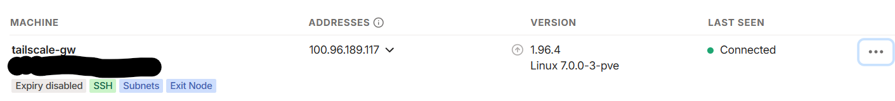
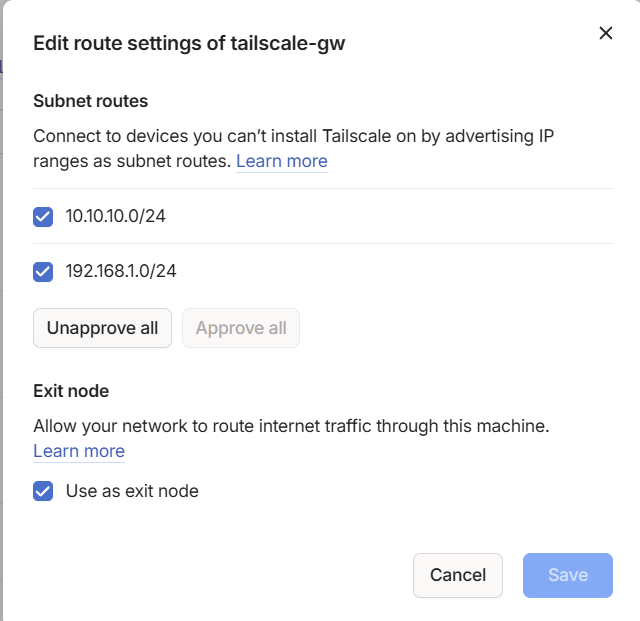

# CT100 - Tailscale VPN

Configuración de Tailscale para acceso remoto seguro al homelab.

## 📋 Información del Contenedor

- **ID:** CT100
- **Hostname:** tailscale-gw
- **IP LAN:** 192.168.1.87/24
- **IP Privada:** 10.10.10.87/24
- **OS:** Debian 12
- **Recursos:** 1 CPU, 1GB RAM, 8GB disco

## 🌐 Función

CT100 actúa como:
- **Tailscale Gateway:** Punto de entrada VPN
- **Subnet Router:** Anuncia redes 192.168.1.0/24 y 10.10.10.0/24
- **NAT:** Permite acceso desde Tailscale a ambas redes
- **Exit Node:** (Opcional) Salida a internet a través del homelab

## 🎯 Propósito

Tailscale proporciona:
- 🔐 Acceso remoto seguro sin abrir puertos
- 🌐 VPN mesh peer-to-peer
- 🔒 Cifrado end-to-end
- 📱 Acceso desde cualquier dispositivo
- 🚀 Subnet routing para acceder a toda la red local

## 📸 Configuración Real

### Rutas Anunciadas

*Subnet routes configuradas: 192.168.1.0/24 y 10.10.10.0/24*

### Máquina en Tailscale

*CT100 registrado en Tailscale como subnet router*

## � Documentación Detallada

Para instrucciones completas de instalación y configuración, consulta:

- **Guía de Instalación:** Ver sección de Tailscale en la documentación principal
- **Configuración de Subnet Router:** Configurar acceso a redes 192.168.1.0/24 y 10.10.10.0/24
- **Gestión de Dispositivos:** Panel de Tailscale en https://login.tailscale.com

## 🔗 Recursos Relacionados

- [Diseño de Red](../03-networking/network-design.md)
- [Rutas Estáticas](../03-networking/static-routes.md)
- [Índice de Documentación](../README.md)

## 🆘 Ayuda

Si necesitas ayuda:
1. Revisa la [documentación completa](../README.md)
2. Consulta [Issues en GitHub](https://github.com/gencinasr-tech/proxmox-homelab/issues)
3. Abre una [nueva pregunta](https://github.com/gencinasr-tech/proxmox-homelab/issues/new?template=question.md)

---

[🏠 Volver al índice](../README.md)
