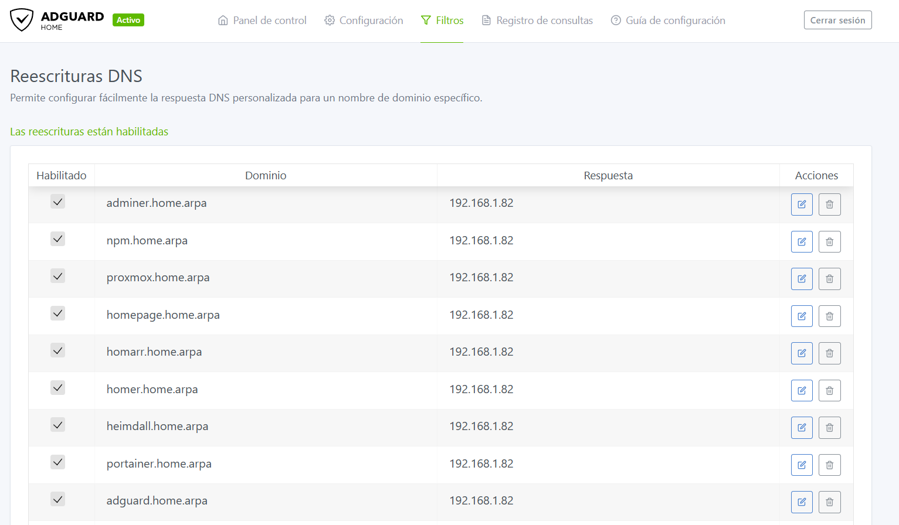

# 🌐 CT103 - DNS / AdGuard Home

Servidor DNS local con bloqueo de publicidad y rastreadores para toda la red.

## 📋 Información del Contenedor

| Parámetro | Valor |
|-----------|-------|
| **ID** | 103 |
| **Hostname** | dns |
| **Tipo** | LXC Container (Unprivileged) |
| **OS** | Debian 13 (Trixie) |
| **CPU** | 1 core |
| **RAM** | 1024 MB |
| **Swap** | 512 MB |
| **Disco** | 12 GB |
| **Red** | vmbr0 - 192.168.1.53/24 (LAN) |
| **Gateway** | 192.168.1.1 |
| **DNS** | 1.1.1.1 |
| **Autostart** | ✅ Recomendado |

## 🎯 Propósito

CT103 proporciona servicios DNS para toda la red local con:

1. **Bloqueo de Publicidad**: Filtra anuncios a nivel de DNS
2. **Bloqueo de Rastreadores**: Protege la privacidad bloqueando trackers
3. **DNS Local**: Resolución de dominios `.home.arpa` internos
4. **DNS Seguro**: DNS-over-HTTPS (DoH) y DNS-over-TLS (DoT)

## 📸 Configuración Real


*DNS Rewrites configurados en AdGuard Home para dominios .home.arpa*
5. **Estadísticas**: Dashboard con métricas de consultas DNS

## 🏗️ Arquitectura

```
Dispositivos en Red
    │
    └─── DNS Query (puerto 53)
            │
            ├─── AdGuard Home (192.168.1.53)
            │       │
            │       ├─── Filtros de Bloqueo
            │       │     └─── Bloquea: ads, trackers, malware
            │       │
            │       ├─── DNS Rewrites (dominios .home.arpa)
            │       │     └─── proxmox.home.arpa → 192.168.1.200
            │       │
            │       └─── Upstream DNS
            │             └─── Cloudflare (1.1.1.1), Google (8.8.8.8)
            │
            └─── Respuesta (IP o bloqueado)
```

## 📦 Instalación

### Paso 1: Crear el Contenedor

En Proxmox Web UI: `Crear CT`

**Configuración General:**
```
CT ID: 103
Hostname: dns
Unprivileged container: ✅
Nesting: ✅
Start at boot: ✅ (recomendado)
```

**Template:**
```
Storage: local
Template: debian-13-standard
```

**Discos:**
```
Storage: local-lvm
Disk size: 12 GB
```

**CPU:**
```
Cores: 1
```

**Memoria:**
```
Memory: 1024 MB
Swap: 512 MB
```

**Red:**
```
Bridge: vmbr0
IPv4: 192.168.1.53/24
Gateway: 192.168.1.1
```

> **Nota**: La IP `.53` es tradicional para servidores DNS (puerto 53)

**DNS:**
```
DNS servers: 1.1.1.1
```

### Paso 2: Configuración Inicial

**Acceder al contenedor:**

```bash
# Desde Proxmox Shell
pct enter 103

# O desde SSH
ssh root@192.168.1.53
```

**Verificar red:**

```bash
ip addr show
ip route
ping -c 3 1.1.1.1
ping -c 3 google.com
```

### Paso 3: Instalar Docker

```bash
# Actualizar sistema
apt update
apt upgrade -y

# Instalar dependencias
apt install -y ca-certificates curl gnupg lsb-release nano htop git

# Añadir repositorio Docker
install -m 0755 -d /etc/apt/keyrings

curl -fsSL https://download.docker.com/linux/debian/gpg \
  | gpg --dearmor -o /etc/apt/keyrings/docker.gpg

chmod a+r /etc/apt/keyrings/docker.gpg

cat > /etc/apt/sources.list.d/docker.sources <<'EOF'
Types: deb
URIs: https://download.docker.com/linux/debian
Suites: trixie
Components: stable
Signed-By: /etc/apt/keyrings/docker.gpg
EOF

# Instalar Docker
apt update
apt install -y docker-ce docker-ce-cli containerd.io docker-buildx-plugin docker-compose-plugin

# Habilitar Docker
systemctl enable --now docker

# Verificar instalación
docker version
docker compose version
```

### Paso 4: Instalar AdGuard Home

```bash
# Crear estructura de directorios
mkdir -p /opt/stacks/adguard/{work,conf}
cd /opt/stacks/adguard

# Crear docker-compose.yml
cat > docker-compose.yml <<'EOF'
services:
  adguard:
    image: adguard/adguardhome:latest
    container_name: adguard
    restart: unless-stopped
    ports:
      - "53:53/tcp"      # DNS
      - "53:53/udp"      # DNS
      - "80:80/tcp"      # Web UI
      - "3000:3000/tcp"  # Setup inicial
      - "853:853/tcp"    # DNS-over-TLS
    volumes:
      - /opt/stacks/adguard/work:/opt/adguardhome/work
      - /opt/stacks/adguard/conf:/opt/adguardhome/conf
    environment:
      - TZ=Europe/Madrid
EOF

# Iniciar AdGuard Home
docker compose up -d

# Verificar que está corriendo
docker ps
docker logs adguard
```

### Paso 5: Configuración Inicial de AdGuard

1. **Acceder al asistente de configuración:**
   ```
   http://192.168.1.53:3000
   ```

2. **Configurar interfaces:**
   - **Admin Web Interface**: Puerto `80`, todas las interfaces
   - **DNS Server**: Puerto `53`, todas las interfaces

3. **Crear usuario administrador:**
   - Usuario: `admin` (o tu preferencia)
   - Contraseña: Usa una contraseña fuerte

4. **Finalizar setup**

5. **Acceder al panel:**
   ```
   http://192.168.1.53
   ```

## ⚙️ Configuración

### Configurar Upstream DNS

**Settings > DNS Settings > Upstream DNS servers:**

```
# Cloudflare DNS
https://dns.cloudflare.com/dns-query
1.1.1.1
1.0.0.1

# Google DNS (backup)
8.8.8.8
8.8.4.4
```

**Opciones recomendadas:**
- ✅ Enable DNSSEC
- ✅ Enable parallel requests
- ✅ Load balancing

### Configurar Filtros de Bloqueo

**Filters > DNS blocklists:**

Listas recomendadas (ya incluidas por defecto):
- ✅ AdGuard DNS filter
- ✅ AdAway Default Blocklist
- ✅ Peter Lowe's List
- ✅ Dan Pollock's List

**Añadir listas adicionales:**

```
# Malware
https://malware-filter.gitlab.io/malware-filter/urlhaus-filter-agh.txt

# Tracking
https://raw.githubusercontent.com/hagezi/dns-blocklists/main/adblock/pro.txt

# Phishing
https://malware-filter.gitlab.io/malware-filter/phishing-filter-agh.txt
```

### Configurar DNS Rewrites (Dominios Locales)

**Filters > DNS rewrites:**

Añadir dominios `.home.arpa` para servicios internos:

| Domain | IP |
|--------|-----|
| proxmox.home.arpa | 192.168.1.200 |
| homepage.home.arpa | 192.168.1.79 |
| homarr.home.arpa | 192.168.1.79 |
| homer.home.arpa | 192.168.1.79 |
| heimdall.home.arpa | 192.168.1.79 |
| portainer.home.arpa | 192.168.1.80 |
| adguard.home.arpa | 192.168.1.53 |
| casaos.home.arpa | 192.168.1.81 |
| syncthing.home.arpa | 192.168.1.81 |
| npm.home.arpa | 192.168.1.82 |
| kuma.home.arpa | 10.10.10.50 |
| grafana.home.arpa | 10.10.10.50 |
| vault.home.arpa | 10.10.10.60 |
| paperless.home.arpa | 10.10.10.40 |
| nextcloud.home.arpa | 10.10.10.65 |
| immich.home.arpa | 10.10.10.30 |
| auth.home.arpa | 10.10.10.74 |
| music.home.arpa | 10.10.10.82 |

### Configurar en Router

Para que todos los dispositivos usen AdGuard Home:

**Opción 1: DHCP del Router**
1. Acceder a configuración del router (192.168.1.1)
2. Buscar configuración DHCP
3. Cambiar DNS primario a: `192.168.1.53`
4. DNS secundario (opcional): `1.1.1.1`

**Opción 2: Configuración Manual**
En cada dispositivo, configurar DNS manualmente a `192.168.1.53`

### Configurar Clientes Específicos

**Settings > Client Settings:**

Puedes configurar reglas específicas por cliente (IP o MAC):
- Bloqueo personalizado
- Servicios bloqueados
- Límites de velocidad
- Tags para organización

## ✅ Verificación

### Verificar Servicio

```bash
# Estado del contenedor
docker ps

# Logs
docker logs adguard -f

# Verificar puerto 53
ss -tulpn | grep :53
```

### Probar DNS

**Desde otro dispositivo en la red:**

```bash
# Probar resolución DNS
nslookup google.com 192.168.1.53
nslookup proxmox.home.arpa 192.168.1.53

# Probar con dig (más detallado)
dig @192.168.1.53 google.com
dig @192.168.1.53 proxmox.home.arpa

# En Windows (PowerShell)
Resolve-DnsName google.com -Server 192.168.1.53
Resolve-DnsName proxmox.home.arpa -Server 192.168.1.53
```

### Verificar Bloqueo

Probar un dominio conocido de publicidad:

```bash
nslookup doubleclick.net 192.168.1.53
# Debe devolver 0.0.0.0 (bloqueado)
```

## 📊 Dashboard y Estadísticas

### Panel Principal

Accede a `http://192.168.1.53` para ver:

- **Consultas totales**: Número de queries DNS
- **Bloqueadas**: Porcentaje de consultas bloqueadas
- **Top clientes**: Dispositivos que más consultan
- **Top dominios**: Dominios más consultados
- **Top bloqueados**: Dominios bloqueados más frecuentes

### Query Log

**Query Log** muestra todas las consultas DNS en tiempo real:
- Timestamp
- Cliente (IP)
- Dominio consultado
- Tipo de consulta (A, AAAA, etc.)
- Respuesta
- Estado (permitido/bloqueado)

## 🔐 Seguridad

### Cambiar Puerto Web UI (Opcional)

Si quieres usar otro puerto para el panel web:

```bash
cd /opt/stacks/adguard
nano docker-compose.yml

# Cambiar:
# - "80:80/tcp"
# Por:
# - "8053:80/tcp"

docker compose down
docker compose up -d
```

### Habilitar HTTPS

**Settings > Encryption settings:**

1. Subir certificado SSL (o usar Let's Encrypt)
2. Habilitar HTTPS
3. Redirigir HTTP a HTTPS

### Proteger con Contraseña

Ya configurado durante el setup inicial. Para cambiar:

**Settings > General settings > Password**

## 🔧 Mantenimiento

### Actualizar AdGuard Home

```bash
cd /opt/stacks/adguard

# Descargar nueva imagen
docker compose pull

# Recrear contenedor
docker compose up -d

# Verificar versión
docker logs adguard | grep version
```

### Actualizar Filtros

Los filtros se actualizan automáticamente cada 24 horas.

**Actualización manual:**
- **Filters > DNS blocklists > Update filters**

### Backup de Configuración

```bash
# Backup manual
cd /opt/stacks/adguard
tar -czf adguard-backup-$(date +%Y%m%d).tar.gz conf/ work/

# Restaurar
tar -xzf adguard-backup-YYYYMMDD.tar.gz
docker compose restart
```

### Limpiar Logs

**Settings > General settings:**
- **Query logs retention**: 24 horas / 7 días / 30 días
- **Statistics retention**: Similar

## 🐛 Troubleshooting

### Puerto 53 ya en uso

```bash
# Verificar qué usa el puerto 53
ss -tulpn | grep :53

# Si es systemd-resolved
systemctl stop systemd-resolved
systemctl disable systemd-resolved

# Reiniciar AdGuard
docker compose restart
```

### DNS no resuelve

```bash
# Verificar que el contenedor está corriendo
docker ps | grep adguard

# Ver logs
docker logs adguard --tail 50

# Verificar conectividad
ping -c 3 192.168.1.53

# Probar DNS directamente
nslookup google.com 192.168.1.53
```

### Bloqueo excesivo

Si se bloquean sitios legítimos:

1. **Query Log** → Buscar el dominio
2. Click en el dominio → **Unblock**
3. O añadir a **Filters > Custom filtering rules**:
   ```
   @@||dominio.com^
   ```

### Rendimiento lento

```bash
# Verificar recursos
docker stats adguard

# Si usa mucha RAM, reducir retención de logs
# Settings > General settings > Query logs retention: 24 hours
```

## 📊 Integración con Monitoring

### Prometheus Metrics

AdGuard Home no expone métricas Prometheus nativamente, pero puedes usar:

**Opción 1: AdGuard Exporter**
```bash
# Añadir exporter en docker-compose.yml
```

**Opción 2: Uptime Kuma**
- Monitorear disponibilidad del servicio DNS
- Alertas si el servicio cae

## 🔗 Recursos

- [Documentación Oficial AdGuard Home](https://github.com/AdguardTeam/AdGuardHome/wiki)
- [Listas de Filtros](https://filterlists.com/)
- [DNS-over-HTTPS](https://github.com/AdguardTeam/AdGuardHome/wiki/Encryption)

## 📚 Próximos Pasos

Después de configurar CT103:

1. **Configurar Proxy** → [CT112 - Nginx Proxy Manager](ct112-proxy.md)
2. **Configurar Router** → Apuntar DHCP a AdGuard
3. **Añadir Dominios** → Configurar DNS rewrites para todos los servicios

---

[⬅️ CT100 Tailscale](ct100-tailscale.md) | [🏠 Índice](../README.md) | [➡️ CT112 Proxy](ct112-proxy.md)
