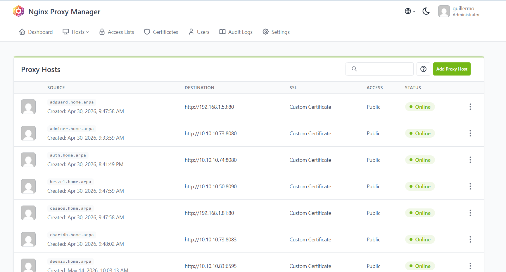

# 🔀 CT112 - Nginx Proxy Manager

Reverse proxy con interfaz web para gestionar certificados SSL y dominios `.home.arpa`.

## 📋 Información del Contenedor

| Parámetro | Valor |
|-----------|-------|
| **ID** | 112 |
| **Hostname** | proxy |
| **Tipo** | LXC Container (Unprivileged) |
| **OS** | Debian 13 (Trixie) |
| **CPU** | 1 core |
| **RAM** | 1024 MB |
| **Swap** | 512 MB |
| **Disco** | 12 GB |
| **Red** | vmbr0 - 192.168.1.82/24 (LAN) |
| **Gateway** | 192.168.1.1 |
| **DNS** | 1.1.1.1 |
| **Autostart** | ✅ Recomendado |

## 🎯 Propósito

CT112 actúa como **reverse proxy centralizado** para todo el homelab:

1. **Proxy HTTPS**: Termina SSL/TLS para todos los servicios
2. **Dominios Locales**: Gestiona todos los dominios `.home.arpa`
3. **Certificados SSL**: Genera y gestiona certificados (autofirmados o Let's Encrypt)
4. **Interfaz Web**: Gestión visual de proxy hosts

## 📸 Configuración Real


*Panel de Nginx Proxy Manager con todos los proxy hosts configurados*
5. **Access Lists**: Control de acceso por IP o autenticación básica

## 🏗️ Arquitectura

```
Dispositivos en Red
    │
    └─── https://servicio.home.arpa
            │
            ├─── DNS (AdGuard) → 192.168.1.82
            │
            └─── Nginx Proxy Manager (CT112)
                    │
                    ├─── Certificado SSL (*.home.arpa)
                    │
                    ├─── Servicios LAN (192.168.1.x)
                    │     ├─── Proxmox (192.168.1.200:8006)
                    │     ├─── Dashboards (192.168.1.79)
                    │     ├─── Portainer (192.168.1.80:9443)
                    │     └─── CasaOS (192.168.1.81)
                    │
                    └─── Servicios Privados (10.10.10.x)
                          ├─── Monitoring (10.10.10.50)
                          ├─── Vaultwarden (10.10.10.60)
                          ├─── Nextcloud (10.10.10.65)
                          ├─── Immich (10.10.10.30)
                          └─── Keycloak (10.10.10.74)
```

## 📦 Instalación

### Paso 1: Crear el Contenedor

En Proxmox Web UI: `Crear CT`

**Configuración General:**
```
CT ID: 112
Hostname: proxy
Unprivileged container: ✅
Nesting: ✅
Start at boot: ✅
```

**Template:**
```
Storage: local
Template: debian-13-standard
```

**Discos:**
```
Storage: local-lvm
Disk size: 12 GB
```

**CPU:**
```
Cores: 1
```

**Memoria:**
```
Memory: 1024 MB
Swap: 512 MB
```

**Red:**
```
Bridge: vmbr0
IPv4: 192.168.1.82/24
Gateway: 192.168.1.1
```

**DNS:**
```
DNS servers: 1.1.1.1
```

### Paso 2: Configuración Inicial

**Acceder al contenedor:**

```bash
# Desde Proxmox Shell
pct enter 112

# O desde SSH
ssh root@192.168.1.82
```

**Verificar red:**

```bash
ip addr show
ip route
ping -c 3 1.1.1.1
ping -c 3 google.com
```

### Paso 3: Instalar Docker

```bash
# Actualizar sistema
apt update
apt upgrade -y

# Instalar dependencias
apt install -y ca-certificates curl gnupg lsb-release nano htop git

# Añadir repositorio Docker
install -m 0755 -d /etc/apt/keyrings

curl -fsSL https://download.docker.com/linux/debian/gpg \
  | gpg --dearmor -o /etc/apt/keyrings/docker.gpg

chmod a+r /etc/apt/keyrings/docker.gpg

cat > /etc/apt/sources.list.d/docker.sources <<'EOF'
Types: deb
URIs: https://download.docker.com/linux/debian
Suites: trixie
Components: stable
Signed-By: /etc/apt/keyrings/docker.gpg
EOF

# Instalar Docker
apt update
apt install -y docker-ce docker-ce-cli containerd.io docker-buildx-plugin docker-compose-plugin

# Habilitar Docker
systemctl enable --now docker

# Verificar instalación
docker version
docker compose version
```

### Paso 4: Configurar Ruta a Red Privada

Para que el proxy pueda acceder a servicios en la red privada (10.10.10.0/24):

```bash
# Añadir ruta temporal
ip route add 10.10.10.0/24 via 192.168.1.87

# Hacer permanente
cat >> /etc/network/interfaces <<'EOF'

post-up ip route add 10.10.10.0/24 via 192.168.1.87 || true
pre-down ip route del 10.10.10.0/24 via 192.168.1.87 || true
EOF

# Verificar conectividad
ping -c 2 10.10.10.50   # CT105 Monitoring
ping -c 2 10.10.10.60   # CT106 Vaultwarden
ping -c 2 10.10.10.65   # CT108 Nextcloud
```

### Paso 5: Instalar Nginx Proxy Manager

```bash
# Crear estructura de directorios
mkdir -p /opt/stacks/nginx-proxy-manager/{data,letsencrypt}
cd /opt/stacks/nginx-proxy-manager

# Crear docker-compose.yml
cat > docker-compose.yml <<'EOF'
services:
  npm:
    image: jc21/nginx-proxy-manager:latest
    container_name: nginx-proxy-manager
    restart: unless-stopped
    ports:
      - "80:80"       # HTTP
      - "81:81"       # Admin UI
      - "443:443"     # HTTPS
    environment:
      - TZ=Europe/Madrid
      - DISABLE_IPV6=true
    volumes:
      - /opt/stacks/nginx-proxy-manager/data:/data
      - /opt/stacks/nginx-proxy-manager/letsencrypt:/etc/letsencrypt
EOF

# Iniciar Nginx Proxy Manager
docker compose up -d

# Verificar que está corriendo
docker ps
docker logs nginx-proxy-manager
```

### Paso 6: Acceso Inicial

1. **Acceder a la interfaz web:**
   ```
   http://192.168.1.82:81
   ```

2. **Credenciales por defecto:**
   - Email: `admin@example.com`
   - Password: `changeme`

3. **Cambiar credenciales inmediatamente:**
   - Cambiar email a tu email real
   - Establecer contraseña fuerte
   - Guardar en Vaultwarden

### Paso 7: Restablecer Contraseña (Si es necesario)

Si las credenciales por defecto no funcionan:

```bash
# Instalar herramientas
apt install -y apache2-utils sqlite3

# Establecer nueva contraseña
NEWPASS='TU_NUEVA_CONTRASEÑA_AQUI'
DB="/opt/stacks/nginx-proxy-manager/data/database.sqlite"

# Obtener ID de usuario
USER_ID=$(sqlite3 "$DB" "SELECT id FROM user WHERE is_deleted=0 ORDER BY id LIMIT 1;")

# Generar hash de contraseña
HASH=$(htpasswd -bnBC 10 "" "$NEWPASS" | tr -d ':\n' | sed 's/^\$2y\$/\$2b\$/')

# Actualizar contraseña en BD
sqlite3 "$DB" "UPDATE auth SET secret='$HASH' WHERE user_id=$USER_ID AND type='password';"

# Reiniciar contenedor
docker restart nginx-proxy-manager
```

## 🔐 Configuración de Certificados SSL

### Generar Certificado Wildcard Autofirmado

Para usar HTTPS con dominios `.home.arpa`:

```bash
# Crear directorio para certificados
mkdir -p /opt/stacks/nginx-proxy-manager/certs/home-arpa

# Generar certificado wildcard (válido 10 años)
openssl req -x509 -nodes -days 3650 -newkey rsa:2048 \
  -keyout /opt/stacks/nginx-proxy-manager/certs/home-arpa/home.arpa.key \
  -out /opt/stacks/nginx-proxy-manager/certs/home-arpa/home.arpa.crt \
  -subj "/CN=*.home.arpa" \
  -addext "subjectAltName=DNS:*.home.arpa,DNS:home.arpa"

# Verificar certificado
openssl x509 -in /opt/stacks/nginx-proxy-manager/certs/home-arpa/home.arpa.crt -text -noout
```

### Añadir Certificado a NPM

1. **En la interfaz web de NPM:**
   - Ir a `SSL Certificates`
   - Click en `Add SSL Certificate`
   - Seleccionar `Custom`

2. **Configurar:**
   - **Name**: `home-arpa-local`
   - **Certificate Key**: Subir `home.arpa.key`
   - **Certificate**: Subir `home.arpa.crt`
   - Click en `Save`

### Confiar en el Certificado (Opcional)

Para evitar advertencias de seguridad en navegadores:

**En Windows:**
1. Copiar `home.arpa.crt` a tu PC
2. Doble click → Instalar certificado
3. Almacén: `Entidades de certificación raíz de confianza`

**En Linux:**
```bash
sudo cp home.arpa.crt /usr/local/share/ca-certificates/
sudo update-ca-certificates
```

**En macOS:**
```bash
sudo security add-trusted-cert -d -r trustRoot -k /Library/Keychains/System.keychain home.arpa.crt
```

## 🌐 Configurar Proxy Hosts

### Crear Proxy Host Manualmente

**Ejemplo: Homarr Dashboard**

1. **En NPM, ir a `Hosts > Proxy Hosts > Add Proxy Host`**

2. **Tab Details:**
   ```
   Domain Names: homarr.home.arpa
   Scheme: http
   Forward Hostname / IP: 192.168.1.79
   Forward Port: 7575
   Cache Assets: ✅
   Block Common Exploits: ✅
   Websockets Support: ✅
   ```

3. **Tab SSL:**
   ```
   SSL Certificate: home-arpa-local
   Force SSL: ✅
   HTTP/2 Support: ✅
   HSTS Enabled: ✅
   HSTS Subdomains: ❌
   ```

4. **Tab Advanced (opcional):**
   ```nginx
   # Configuración adicional si es necesaria
   ```

5. **Click en `Save`**

### Lista Completa de Proxy Hosts

| Dominio | Scheme | IP | Puerto | Notas |
|---------|--------|-----|--------|-------|
| npm.home.arpa | http | 192.168.1.82 | 81 | Admin UI |
| proxmox.home.arpa | https | 192.168.1.200 | 8006 | Requiere config avanzada |
| homepage.home.arpa | http | 192.168.1.79 | 3000 | |
| homarr.home.arpa | http | 192.168.1.79 | 7575 | |
| homer.home.arpa | http | 192.168.1.79 | 8080 | |
| heimdall.home.arpa | http | 192.168.1.79 | 8081 | |
| portainer.home.arpa | https | 192.168.1.80 | 9443 | Requiere config avanzada |
| adguard.home.arpa | http | 192.168.1.53 | 80 | |
| casaos.home.arpa | http | 192.168.1.81 | 80 | |
| syncthing.home.arpa | http | 192.168.1.81 | 8384 | |
| duplicati.home.arpa | http | 192.168.1.81 | 8200 | |
| kuma.home.arpa | http | 10.10.10.50 | 3001 | |
| beszel.home.arpa | http | 10.10.10.50 | 8090 | |
| grafana.home.arpa | http | 10.10.10.50 | 3002 | |
| prometheus.home.arpa | http | 10.10.10.50 | 9090 | |
| speedtest.home.arpa | http | 10.10.10.50 | 8085 | |
| scrutiny.home.arpa | http | 10.10.10.50 | 8086 | |
| vault.home.arpa | http | 10.10.10.60 | 8080 | |
| paperless.home.arpa | http | 10.10.10.40 | 8000 | |
| nextcloud.home.arpa | http | 10.10.10.65 | 8088 | Requiere config avanzada |
| immich.home.arpa | http | 10.10.10.30 | 2283 | |
| tools.home.arpa | http | 10.10.10.70 | 8080 | |
| pdf.home.arpa | http | 10.10.10.70 | 8081 | |
| adminer.home.arpa | http | 10.10.10.73 | 8080 | |
| pgadmin.home.arpa | http | 10.10.10.73 | 8082 | |
| chartdb.home.arpa | http | 10.10.10.73 | 8083 | |
| auth.home.arpa | http | 10.10.10.74 | 8080 | Requiere config avanzada |
| music.home.arpa | http | 10.10.10.82 | 4533 | |
| downloads.home.arpa | http | 10.10.10.83 | 6595 | |

### Configuraciones Avanzadas Especiales

**Proxmox (proxmox.home.arpa):**
```nginx
proxy_ssl_verify off;

proxy_buffering off;
proxy_request_buffering off;

proxy_read_timeout 3600s;
proxy_send_timeout 3600s;

proxy_set_header Upgrade $http_upgrade;
proxy_set_header Connection "upgrade";
```

**Portainer (portainer.home.arpa):**
```nginx
proxy_ssl_verify off;

proxy_buffering off;
proxy_request_buffering off;

proxy_read_timeout 3600s;
proxy_send_timeout 3600s;

proxy_set_header Upgrade $http_upgrade;
proxy_set_header Connection "upgrade";
proxy_set_header X-Forwarded-Host $host;
proxy_set_header X-Forwarded-Port 443;
proxy_set_header X-Forwarded-Proto https;
```

**Keycloak (auth.home.arpa):**
```nginx
proxy_set_header X-Forwarded-Proto https;
proxy_set_header X-Forwarded-Port 443;
proxy_set_header X-Forwarded-Host $host;
proxy_set_header Host $host;

proxy_buffering off;
proxy_request_buffering off;

proxy_read_timeout 3600s;
proxy_send_timeout 3600s;

proxy_set_header X-Real-IP $remote_addr;
proxy_set_header X-Forwarded-For $proxy_add_x_forwarded_for;
```

**Nextcloud (nextcloud.home.arpa):**
```nginx
client_max_body_size 10G;
proxy_request_buffering off;
```

## ✅ Verificación

### Verificar Servicio

```bash
# Estado del contenedor
docker ps | grep nginx-proxy-manager

# Logs
docker logs nginx-proxy-manager -f

# Verificar puertos
ss -tulpn | grep -E ':(80|81|443)'
```

### Probar Proxy Hosts

**Desde un navegador en la red:**

```
https://homarr.home.arpa
https://grafana.home.arpa
https://nextcloud.home.arpa
```

**Desde terminal:**

```bash
# Verificar resolución DNS
nslookup homarr.home.arpa 192.168.1.53

# Probar HTTP
curl -I http://192.168.1.82

# Probar HTTPS (ignorando certificado autofirmado)
curl -Ik https://homarr.home.arpa
```

## 🔧 Mantenimiento

### Actualizar Nginx Proxy Manager

```bash
cd /opt/stacks/nginx-proxy-manager

# Descargar nueva imagen
docker compose pull

# Recrear contenedor
docker compose up -d

# Verificar versión
docker logs nginx-proxy-manager | grep version
```

### Backup de Configuración

```bash
# Backup manual
cd /opt/stacks/nginx-proxy-manager
tar -czf npm-backup-$(date +%Y%m%d).tar.gz data/ letsencrypt/

# Restaurar
tar -xzf npm-backup-YYYYMMDD.tar.gz
docker compose restart
```

### Ver Logs

```bash
# Logs en tiempo real
docker logs nginx-proxy-manager -f

# Últimas 100 líneas
docker logs nginx-proxy-manager --tail 100

# Logs de Nginx
docker exec nginx-proxy-manager tail -f /data/logs/proxy-host-*.log
```

## 🐛 Troubleshooting

### Error 502 Bad Gateway

**Causas comunes:**
- Servicio backend no está corriendo
- IP o puerto incorrecto
- Firewall bloqueando conexión

**Solución:**
```bash
# Verificar que el servicio backend está activo
curl http://IP_BACKEND:PUERTO

# Verificar conectividad desde el proxy
pct enter 112
ping IP_BACKEND
curl http://IP_BACKEND:PUERTO

# Verificar logs
docker logs nginx-proxy-manager --tail 50
```

### Certificado SSL no funciona

**Solución:**
```bash
# Verificar que el certificado está cargado
ls -lh /opt/stacks/nginx-proxy-manager/certs/home-arpa/

# Regenerar certificado
cd /opt/stacks/nginx-proxy-manager/certs/home-arpa
rm -f home.arpa.*

openssl req -x509 -nodes -days 3650 -newkey rsa:2048 \
  -keyout home.arpa.key \
  -out home.arpa.crt \
  -subj "/CN=*.home.arpa" \
  -addext "subjectAltName=DNS:*.home.arpa,DNS:home.arpa"

# Recargar en NPM UI
```

### No puedo acceder a servicios privados

**Solución:**
```bash
# Verificar ruta estática
ip route | grep 10.10.10.0

# Si no existe, añadir
ip route add 10.10.10.0/24 via 192.168.1.87

# Hacer permanente
cat >> /etc/network/interfaces <<'EOF'

post-up ip route add 10.10.10.0/24 via 192.168.1.87 || true
pre-down ip route del 10.10.10.0/24 via 192.168.1.87 || true
EOF

# Probar conectividad
ping -c 3 10.10.10.50
```

### Websockets no funcionan

**Solución:**
En la configuración del Proxy Host:
- ✅ Habilitar `Websockets Support`
- En Advanced, añadir:
  ```nginx
  proxy_set_header Upgrade $http_upgrade;
  proxy_set_header Connection "upgrade";
  ```

## 📊 Integración con Otros Servicios

### AdGuard Home (DNS)

Todos los dominios `.home.arpa` deben apuntar al proxy:

**En AdGuard Home > Filters > DNS rewrites:**
```
*.home.arpa → 192.168.1.82
```

O individualmente cada dominio.

### Portainer

Añadir Portainer Agent para gestión:

```bash
mkdir -p /opt/stacks/portainer-agent
cd /opt/stacks/portainer-agent

cat > docker-compose.yml <<'EOF'
services:
  portainer-agent:
    image: portainer/agent:latest
    container_name: portainer-agent
    restart: unless-stopped
    ports:
      - "9001:9001"
    volumes:
      - /var/run/docker.sock:/var/run/docker.sock
      - /var/lib/docker/volumes:/var/lib/docker/volumes
EOF

docker compose up -d
```

En Portainer, añadir environment:
- **Name**: `CT112-proxy`
- **URL**: `tcp://192.168.1.82:9001`

## 🔗 Recursos

- [Documentación Oficial NPM](https://nginxproxymanager.com/guide/)
- [GitHub NPM](https://github.com/NginxProxyManager/nginx-proxy-manager)
- [Nginx Documentation](https://nginx.org/en/docs/)

## 📚 Próximos Pasos

Después de configurar CT112:

1. **Configurar DNS** → Añadir todos los dominios en AdGuard Home
2. **Crear Proxy Hosts** → Para cada servicio del homelab
3. **Configurar Servicios** → Ajustar trusted domains/proxies en apps

---

[⬅️ CT103 DNS](ct103-dns.md) | [🏠 Índice](../README.md) | [➡️ Management](../05-management/)
