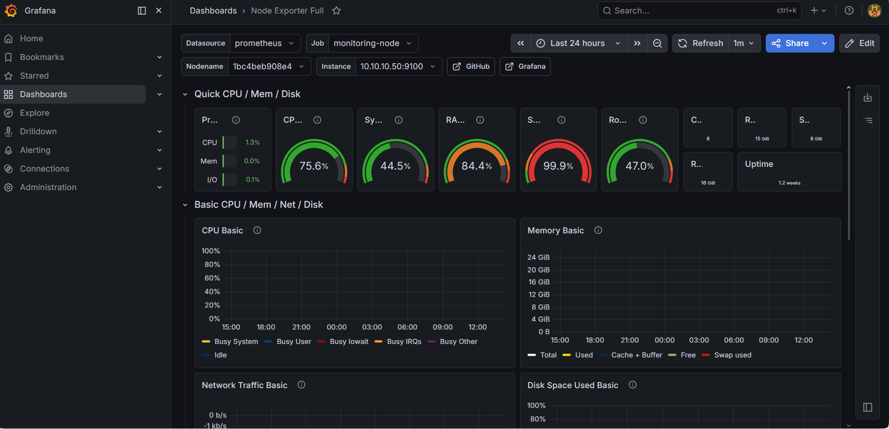

# CT105 - Monitoring Stack

Stack completo de monitorización con Prometheus, Grafana, Uptime Kuma, Speedtest Tracker, Scrutiny (SMART) y Beszel.

## 📋 Información del Contenedor

- **ID:** CT105
- **Hostname:** monitoring
- **IP Privada:** 10.10.10.50
- **OS:** Debian 12
- **Recursos:** 1 CPU, 1GB RAM, 16GB disco
- **Red:** vmbr10 (Red Privada)
- **Gateway:** 10.10.10.87

## 🎯 Propósito

El stack de monitorización proporciona:
- 📊 **Prometheus:** Recolección de métricas de todos los servicios
- 📈 **Grafana:** Visualización de métricas con dashboards
- 🔔 **Uptime Kuma:** Monitoreo de disponibilidad de servicios
- 🚀 **Speedtest Tracker:** Monitoreo de velocidad de Internet
- 💾 **Scrutiny:** Monitoreo SMART de discos
- 🖥️ **Beszel:** Monitoreo de recursos de contenedores
- 📡 **Node Exporter:** Métricas del sistema operativo
- 🐳 **cAdvisor:** Métricas de contenedores Docker

## 🔒 Seguridad

- **Criticidad:** ALTA (visibilidad de toda la infraestructura)

## 📸 Dashboard Real


*Dashboard de Grafana mostrando métricas del sistema en tiempo real*
- **Acceso:** HTTPS vía proxy para servicios web
- **Métricas:** Solo accesibles desde red privada
- **Backups:** Configuración y dashboards

---

## 🧱 Instalación Paso a Paso

### 1. Crear el Contenedor en Proxmox

Desde la interfaz web de Proxmox:

```bash
# Valores de configuración:
CT ID: 105
Hostname: monitoring
Template: debian-12-standard
Disco: 16 GB
CPU: 1 core
RAM: 1024 MB
Swap: 512 MB
Red: vmbr10
IP: 10.10.10.50/24
Gateway: 10.10.10.87
DNS: 192.168.1.53
Opciones: Unprivileged + Nesting habilitado
```

### 2. Verificar Conectividad

Acceder al contenedor:

```bash
pct enter 105

# Verificar red
ip a
ip route
ping -c 3 10.10.10.87
ping -c 3 1.1.1.1
ping -c 3 google.com
```

### 3. Instalar Docker y Docker Compose

```bash
# Actualizar sistema
apt update && apt upgrade -y

# Instalar dependencias
apt install -y ca-certificates curl gnupg lsb-release

# Añadir repositorio de Docker
install -m 0755 -d /etc/apt/keyrings
curl -fsSL https://download.docker.com/linux/debian/gpg -o /etc/apt/keyrings/docker.asc
chmod a+r /etc/apt/keyrings/docker.asc

echo \
  "deb [arch=$(dpkg --print-architecture) signed-by=/etc/apt/keyrings/docker.asc] https://download.docker.com/linux/debian \
  $(. /etc/os-release && echo "$VERSION_CODENAME") stable" | \
  tee /etc/apt/sources.list.d/docker.list > /dev/null

# Instalar Docker
apt update
apt install -y docker-ce docker-ce-cli containerd.io docker-buildx-plugin docker-compose-plugin

# Verificar instalación
docker --version
docker compose version
```

---

## 📊 Prometheus + Grafana

### 1. Preparar Estructura

```bash
mkdir -p /opt/stacks/monitoring/{prometheus,grafana}
cd /opt/stacks/monitoring
```

### 2. Configurar Prometheus

```bash
cat > /opt/stacks/monitoring/prometheus/prometheus.yml <<'EOF'
global:
  scrape_interval: 15s
  evaluation_interval: 15s

scrape_configs:
  # Prometheus mismo
  - job_name: "prometheus"
    static_configs:
      - targets: ["prometheus:9090"]

  # Node Exporter del CT105
  - job_name: "monitoring-node"
    static_configs:
      - targets: ["10.10.10.50:9100"]
        labels:
          host: "CT105-monitoring"

  # cAdvisor de todos los contenedores
  - job_name: "cadvisor"
    static_configs:
      - targets:
          - "10.10.10.50:8089"
        labels:
          host: "CT105-monitoring"
      
      - targets:
          - "192.168.1.79:8089"
        labels:
          host: "CT101-dashboard"
      
      - targets:
          - "192.168.1.80:8089"
        labels:
          host: "CT102-portainer"
      
      - targets:
          - "192.168.1.81:8089"
        labels:
          host: "VM104-casaos-nas"
      
      - targets:
          - "10.10.10.60:8089"
        labels:
          host: "CT106-vaultwarden"
      
      - targets:
          - "10.10.10.40:8089"
        labels:
          host: "CT107-paperless"
      
      - targets:
          - "10.10.10.65:8089"
        labels:
          host: "CT108-nextcloud"
      
      - targets:
          - "10.10.10.30:8089"
        labels:
          host: "VM109-immich"
      
      - targets:
          - "10.10.10.70:8089"
        labels:
          host: "CT110-tools"
      
      - targets:
          - "10.10.10.74:8089"
        labels:
          host: "CT113-identity"
      
      - targets:
          - "10.10.10.82:8089"
        labels:
          host: "CT114-music"
      
      - targets:
          - "10.10.10.83:8089"
        labels:
          host: "CT115-downloads"
EOF
```

### 3. Crear Docker Compose Principal

```bash
cat > docker-compose.yml <<'EOF'
services:
  prometheus:
    image: prom/prometheus:latest
    container_name: prometheus
    restart: unless-stopped
    ports:
      - "10.10.10.50:9090:9090"
    volumes:
      - /opt/stacks/monitoring/prometheus/prometheus.yml:/etc/prometheus/prometheus.yml
      - /opt/stacks/monitoring/prometheus/data:/prometheus
    command:
      - '--config.file=/etc/prometheus/prometheus.yml'
      - '--storage.tsdb.path=/prometheus'
      - '--web.console.libraries=/usr/share/prometheus/console_libraries'
      - '--web.console.templates=/usr/share/prometheus/consoles'
    networks:
      - monitoring

  grafana:
    image: grafana/grafana-oss:latest
    container_name: grafana
    restart: unless-stopped
    ports:
      - "10.10.10.50:3002:3000"
    environment:
      - GF_SECURITY_ADMIN_USER=admin
      - GF_SECURITY_ADMIN_PASSWORD=admin
      - GF_INSTALL_PLUGINS=
    volumes:
      - /opt/stacks/monitoring/grafana:/var/lib/grafana
    networks:
      - monitoring

networks:
  monitoring:
    driver: bridge
EOF

# Ajustar permisos
mkdir -p /opt/stacks/monitoring/prometheus/data
chown -R 65534:65534 /opt/stacks/monitoring/prometheus/data
chown -R 472:472 /opt/stacks/monitoring/grafana

# Levantar servicios
docker compose up -d

# Verificar
docker ps
docker logs -f grafana
```

### 4. Configurar Grafana

1. Acceder a `http://10.10.10.50:3002`
2. Login: `admin` / `admin`
3. Cambiar contraseña cuando lo pida

**Añadir Datasource Prometheus:**
1. Ir a **Configuration** → **Data sources**
2. Click **Add data source**
3. Seleccionar **Prometheus**
4. **URL:** `http://prometheus:9090`
5. Click **Save & test**

**Importar Dashboard:**
1. Ir a **Dashboards** → **Import**
2. **Import via grafana.com:** `1860` (Node Exporter Full)
3. Seleccionar datasource Prometheus
4. Click **Import**

---

## 📡 Node Exporter

Instalar en el mismo CT105:

```bash
mkdir -p /opt/stacks/node-exporter
cd /opt/stacks/node-exporter

cat > docker-compose.yml <<'EOF'
services:
  node-exporter:
    image: prom/node-exporter:latest
    container_name: node-exporter
    restart: unless-stopped
    ports:
      - "9100:9100"
    command:
      - '--path.rootfs=/host'
    volumes:
      - '/:/host:ro,rslave'
    pid: host
EOF

docker compose up -d
docker ps | grep node-exporter
```

---

## 🐳 cAdvisor

Instalar en TODOS los contenedores/VMs con Docker:

```bash
# Ejecutar en cada CT/VM
mkdir -p /opt/stacks/cadvisor
cd /opt/stacks/cadvisor

cat > docker-compose.yml <<'EOF'
services:
  cadvisor:
    image: gcr.io/cadvisor/cadvisor:latest
    container_name: cadvisor
    restart: unless-stopped
    ports:
      - "8089:8080"
    volumes:
      - /:/rootfs:ro
      - /var/run:/var/run:ro
      - /sys:/sys:ro
      - /var/lib/docker/:/var/lib/docker:ro
      - /dev/disk/:/dev/disk:ro
    privileged: true
    devices:
      - /dev/kmsg
EOF

docker compose up -d
docker ps | grep cadvisor
```

**Instalar en:**
- CT101, CT102, VM104, CT105, CT106, CT107, CT108, VM109, CT110, CT113, CT114, CT115

---

## 🔔 Uptime Kuma

### 1. Instalar Uptime Kuma

```bash
mkdir -p /opt/stacks/uptime-kuma
cd /opt/stacks/uptime-kuma

cat > docker-compose.yml <<'EOF'
services:
  uptime-kuma:
    image: louislam/uptime-kuma:latest
    container_name: uptime-kuma
    restart: unless-stopped
    ports:
      - "10.10.10.50:3001:3001"
    volumes:
      - /opt/stacks/uptime-kuma/data:/app/data
EOF

docker compose up -d
docker logs -f uptime-kuma
```

### 2. Configuración Inicial

1. Acceder a `http://10.10.10.50:3001`
2. Crear cuenta de administrador:
   - **Username:** admin
   - **Password:** contraseña segura
3. Click **Create**

### 3. Añadir Monitores

**Servicios Web (HTTP/HTTPS):**

Para cada servicio, crear monitor:
- **Type:** HTTP(s)
- **Friendly Name:** Nombre del servicio
- **URL:** URL del servicio
- **Heartbeat Interval:** 60 segundos
- **Retries:** 3
- **Heartbeat Retry Interval:** 60 segundos

**Lista de servicios a monitorear:**
- Homarr: `https://homarr.home.arpa`
- Portainer: `https://portainer.home.arpa`
- AdGuard Home: `https://adguard.home.arpa`
- Nginx Proxy Manager: `https://npm.home.arpa`
- Grafana: `https://grafana.home.arpa`
- Vaultwarden: `https://vaultwarden.tailXXXX.ts.net`
- Paperless: `https://paperless.home.arpa`
- Nextcloud: `https://nextcloud.home.arpa`
- Immich: `https://immich.home.arpa`
- Keycloak: `https://auth.home.arpa`
- Navidrome: `https://navidrome.home.arpa`

**Servicios TCP:**

Para bases de datos y servicios internos:
- **Type:** TCP Port
- **Hostname:** IP del servicio
- **Port:** Puerto del servicio

---

## 🚀 Speedtest Tracker

### 1. Instalar Speedtest Tracker

```bash
mkdir -p /opt/stacks/speedtest-tracker/{config,keys}
cd /opt/stacks/speedtest-tracker

# Generar APP_KEY
APP_KEY="base64:$(openssl rand -base64 32)"
echo "APP_KEY: $APP_KEY"

cat > docker-compose.yml <<EOF
services:
  speedtest-tracker:
    image: lscr.io/linuxserver/speedtest-tracker:latest
    container_name: speedtest-tracker
    restart: unless-stopped
    ports:
      - "10.10.10.50:8085:80"
    environment:
      - PUID=1000
      - PGID=1000
      - TZ=Europe/Madrid
      - APP_KEY=$APP_KEY
      - DB_CONNECTION=sqlite
      - SPEEDTEST_SCHEDULE=0 */6 * * *
    volumes:
      - /opt/stacks/speedtest-tracker/config:/config
EOF

docker compose up -d
docker logs -f speedtest-tracker
```

### 2. Configuración Inicial

1. Acceder a `http://10.10.10.50:8085`
2. Login con:
   - **Email:** `admin@example.com`
   - **Password:** `password`
3. Cambiar contraseña inmediatamente
4. Ir a **Settings** → **General**
5. Configurar:
   - **Speedtest Schedule:** Cada 6 horas (ya configurado)
   - **Server:** Auto (o seleccionar servidor específico)
6. Click **Save**

---

## 💾 Scrutiny (SMART Monitoring)

### 1. Instalar Scrutiny Web + InfluxDB

```bash
mkdir -p /opt/stacks/scrutiny/{config,influxdb}
cd /opt/stacks/scrutiny

cat > docker-compose.yml <<'EOF'
services:
  influxdb:
    image: influxdb:2.8
    container_name: scrutiny-influxdb
    restart: unless-stopped
    volumes:
      - /opt/stacks/scrutiny/influxdb:/var/lib/influxdb2
    environment:
      - DOCKER_INFLUXDB_INIT_MODE=setup
      - DOCKER_INFLUXDB_INIT_USERNAME=scrutiny
      - DOCKER_INFLUXDB_INIT_PASSWORD=scrutiny-password
      - DOCKER_INFLUXDB_INIT_ORG=scrutiny
      - DOCKER_INFLUXDB_INIT_BUCKET=scrutiny
      - DOCKER_INFLUXDB_INIT_ADMIN_TOKEN=scrutiny-token

  scrutiny:
    image: ghcr.io/analogj/scrutiny:latest-web
    container_name: scrutiny
    restart: unless-stopped
    ports:
      - "10.10.10.50:8086:8080"
    volumes:
      - /opt/stacks/scrutiny/config:/opt/scrutiny/config
    environment:
      - SCRUTINY_WEB_INFLUXDB_HOST=influxdb
      - SCRUTINY_WEB_INFLUXDB_PORT=8086
      - SCRUTINY_WEB_INFLUXDB_TOKEN=scrutiny-token
      - SCRUTINY_WEB_INFLUXDB_ORG=scrutiny
      - SCRUTINY_WEB_INFLUXDB_BUCKET=scrutiny
    depends_on:
      - influxdb
EOF

docker compose up -d
docker logs -f scrutiny
```

### 2. Instalar Scrutiny Collector en Proxmox Host

**Desde el host Proxmox (no desde el CT):**

```bash
# Crear directorios
mkdir -p /opt/scrutiny/bin /opt/scrutiny/config

# Descargar collector
curl -L \
  https://github.com/AnalogJ/scrutiny/releases/latest/download/scrutiny-collector-metrics-linux-amd64 \
  -o /opt/scrutiny/bin/scrutiny-collector-metrics-linux-amd64

chmod +x /opt/scrutiny/bin/scrutiny-collector-metrics-linux-amd64

# Configurar collector
cat > /opt/scrutiny/config/collector.yaml <<'EOF'
version: 1
host:
  id: "pve"
api:
  endpoint: "http://10.10.10.50:8086"
commands:
  metrics_smartctl_bin: /usr/sbin/smartctl
devices:
  - device: /dev/sda
    type: sat
  - device: /dev/nvme0n1
    type: nvme
EOF

# Test manual
/opt/scrutiny/bin/scrutiny-collector-metrics-linux-amd64 run \
  --config /opt/scrutiny/config/collector.yaml \
  --debug
```

### 3. Automatizar Collector con Systemd

```bash
# Crear servicio
cat > /etc/systemd/system/scrutiny-collector.service <<'EOF'
[Unit]
Description=Scrutiny Collector for PVE disks
After=network-online.target
Wants=network-online.target

[Service]
Type=oneshot
ExecStart=/opt/scrutiny/bin/scrutiny-collector-metrics-linux-amd64 run --config /opt/scrutiny/config/collector.yaml
EOF

# Crear timer (cada hora)
cat > /etc/systemd/system/scrutiny-collector.timer <<'EOF'
[Unit]
Description=Run Scrutiny Collector every hour

[Timer]
OnBootSec=5min
OnUnitActiveSec=1h
Persistent=true

[Install]
WantedBy=timers.target
EOF

# Activar y arrancar
systemctl daemon-reload
systemctl enable --now scrutiny-collector.timer
systemctl start scrutiny-collector.service

# Verificar
systemctl status scrutiny-collector.timer
systemctl list-timers | grep scrutiny
```

**Acceso:** `http://10.10.10.50:8086`

---

## 🖥️ Beszel (Resource Monitoring)

### 1. Instalar Beszel Hub

```bash
mkdir -p /opt/stacks/beszel
cd /opt/stacks/beszel

cat > docker-compose.yml <<'EOF'
services:
  beszel:
    image: henrygd/beszel:latest
    container_name: beszel
    restart: unless-stopped
    ports:
      - "10.10.10.50:8090:8090"
    volumes:
      - /opt/stacks/beszel/data:/beszel/data
EOF

docker compose up -d
docker logs -f beszel
```

### 2. Configuración Inicial

1. Acceder a `http://10.10.10.50:8090`
2. Crear cuenta de administrador
3. Login

### 3. Añadir Agentes

Para cada CT/VM que quieras monitorear:

1. En Beszel Hub, ir a **Systems** → **Add System**
2. **Name:** Nombre del sistema (ej: CT101-dashboard)
3. **Host:** IP del sistema
4. **Port:** 45876 (puerto por defecto del agente)
5. Click **Generate** para obtener el docker-compose del agente
6. Copiar el docker-compose generado

**Instalar agente en cada sistema:**

```bash
# En cada CT/VM
mkdir -p /opt/stacks/beszel-agent
cd /opt/stacks/beszel-agent

# Pegar el docker-compose generado por Beszel Hub
cat > docker-compose.yml <<'EOF'
# Pegar aquí el compose generado
EOF

docker compose up -d
docker ps | grep beszel-agent
```

**Sistemas a monitorear:**
- CT101-dashboard
- CT105-monitoring
- CT114-music
- CT115-downloads

---

## 🔧 Instalar Portainer Agent

```bash
mkdir -p /opt/stacks/portainer-agent
cd /opt/stacks/portainer-agent

cat > docker-compose.yml <<'EOF'
services:
  portainer-agent:
    image: portainer/agent:latest
    container_name: portainer-agent
    restart: unless-stopped
    ports:
      - "9001:9001"
    volumes:
      - /var/run/docker.sock:/var/run/docker.sock
      - /var/lib/docker/volumes:/var/lib/docker/volumes
EOF

docker compose up -d
docker ps | grep portainer-agent
```

**Añadir en Portainer:**
- Name: `CT105-monitoring`
- Environment URL: `tcp://10.10.10.50:9001`

---

## ⚙️ Configuración de DNS y Proxy

### DNS Rewrites en AdGuard Home

Configurar los siguientes dominios:

| Dominio | IP |
|---------|-----|
| `kuma.home.arpa` | 192.168.1.82 |
| `beszel.home.arpa` | 192.168.1.82 |
| `grafana.home.arpa` | 192.168.1.82 |
| `prometheus.home.arpa` | 192.168.1.82 |
| `speedtest.home.arpa` | 192.168.1.82 |
| `scrutiny.home.arpa` | 192.168.1.82 |

### Proxy Hosts en Nginx Proxy Manager

Para cada servicio, crear Proxy Host con:

**Configuración común:**
- **Scheme:** `http`
- **Forward Hostname/IP:** `10.10.10.50`
- **SSL Certificate:** `home-arpa-local`
- **Force SSL:** ON
- **HTTP/2 Support:** ON
- **Websockets Support:** ON

**Puertos específicos:**
- `kuma.home.arpa` → Puerto 3001
- `beszel.home.arpa` → Puerto 8090
- `grafana.home.arpa` → Puerto 3002
- `prometheus.home.arpa` → Puerto 9090
- `speedtest.home.arpa` → Puerto 8085
- `scrutiny.home.arpa` → Puerto 8086

---

## 📊 Dashboards de Grafana

### Dashboards Recomendados

Importar desde grafana.com:

1. **Node Exporter Full** (ID: 1860)
   - Métricas del sistema operativo
   - CPU, RAM, disco, red

2. **Docker Container & Host Metrics** (ID: 10619)
   - Métricas de contenedores Docker
   - Uso de recursos por contenedor

3. **Prometheus 2.0 Stats** (ID: 3662)
   - Estadísticas de Prometheus
   - Targets, scrapes, storage

### Crear Dashboard Personalizado

1. Ir a **Dashboards** → **New** → **New Dashboard**
2. Click **Add visualization**
3. Seleccionar datasource Prometheus
4. Configurar query y visualización
5. Click **Save**

---

## ✅ Verificación

### Test de Prometheus

```bash
# Verificar targets
curl http://10.10.10.50:9090/api/v1/targets | jq

# Verificar métricas
curl http://10.10.10.50:9090/api/v1/query?query=up
```

### Test de Grafana

1. Acceder a `https://grafana.home.arpa`
2. Verificar que el datasource Prometheus está conectado
3. Verificar que los dashboards muestran datos

### Test de Uptime Kuma

1. Acceder a `https://kuma.home.arpa`
2. Verificar que todos los monitores están UP
3. Verificar notificaciones (si configuradas)

---

## 🆘 Troubleshooting

### Prometheus no scrape targets

**Causa:** Firewall o servicio no accesible.

**Solución:**

```bash
# Verificar conectividad
curl http://TARGET_IP:TARGET_PORT/metrics

# Verificar configuración
docker exec prometheus promtool check config /etc/prometheus/prometheus.yml

# Reiniciar Prometheus
docker restart prometheus
```

### Grafana no muestra datos

**Causa:** Datasource mal configurado.

**Solución:**

1. Ir a **Configuration** → **Data sources**
2. Click en Prometheus
3. Verificar URL: `http://prometheus:9090`
4. Click **Save & test**

### Uptime Kuma no envía notificaciones

**Causa:** Notificaciones no configuradas.

**Solución:**

1. Ir a **Settings** → **Notifications**
2. Añadir método de notificación (Email, Telegram, Discord, etc.)
3. Configurar y probar
4. Asignar a monitores

---

## 🔗 Recursos Relacionados

- [SSO en Grafana](../09-authentication/sso-grafana.md)
- [Red Privada](../03-networking/private-network.md)
- [CT112 - Nginx Proxy Manager](../04-core-services/ct112-proxy.md)

---

## 📚 Referencias

- [Prometheus Documentation](https://prometheus.io/docs/)
- [Grafana Documentation](https://grafana.com/docs/)
- [Uptime Kuma](https://github.com/louislam/uptime-kuma)
- [Scrutiny](https://github.com/AnalogJ/scrutiny)
- [Beszel](https://github.com/henrygd/beszel)

**Última actualización**: 2026-05-19

---

[🏠 Volver al índice](../README.md) | [📋 Ver Inventario](../reference/inventory.md)
