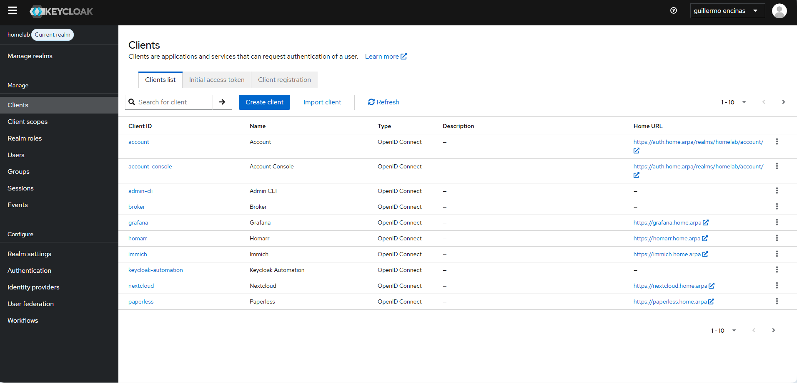

# CT113 - Keycloak (SSO)

Servidor de autenticación centralizada y Single Sign-On (SSO) con integración de Google OAuth.

## 📋 Información del Contenedor

- **ID:** CT113
- **Hostname:** identity
- **IP Privada:** 10.10.10.74
- **OS:** Debian 12
- **Recursos:** 2 CPU, 2GB RAM, 24GB disco
- **Red:** vmbr10 (Red Privada)
- **Gateway:** 10.10.10.87

## 🎯 Propósito

Keycloak proporciona:
- 🔐 Autenticación centralizada (SSO)
- 👥 Gestión de usuarios y roles
- 🔑 OAuth 2.0 / OpenID Connect
- 🛡️ 2FA y autenticación fuerte
- 📊 Auditoría de accesos
- 🌐 Federación de identidades (Google OAuth)

## 🔒 Seguridad

- **Criticidad:** CRÍTICA
- **Acceso:** Solo vía proxy con SSL (https://auth.home.arpa)
- **Backups:** Diarios automáticos de PostgreSQL

## 📸 Configuración Real


*Clientes OAuth configurados en Keycloak para SSO con los servicios del homelab*
- **Certificados:** SSL local vía Nginx Proxy Manager

---

## 🧱 Instalación Paso a Paso

### 1. Crear el Contenedor en Proxmox

Desde la interfaz web de Proxmox:

```bash
# Valores de configuración:
CT ID: 113
Hostname: identity
Template: debian-13-standard
Disco: 24 GB
CPU: 2 cores
RAM: 2048 MB
Swap: 1024 MB
Red: vmbr10
IP: 10.10.10.74/24
Gateway: 10.10.10.87
DNS: 192.168.1.53
Opciones: Unprivileged + Nesting habilitado
```

### 2. Verificar Conectividad

Acceder al contenedor y verificar red:

```bash
pct enter 113

# Verificar conectividad
ip a
ip route
ping -c 3 10.10.10.87
ping -c 3 1.1.1.1
ping -c 3 google.com
```

### 3. Instalar Docker y Docker Compose

```bash
# Actualizar sistema
apt update && apt upgrade -y

# Instalar dependencias
apt install -y ca-certificates curl gnupg lsb-release

# Añadir repositorio de Docker
install -m 0755 -d /etc/apt/keyrings
curl -fsSL https://download.docker.com/linux/debian/gpg -o /etc/apt/keyrings/docker.asc
chmod a+r /etc/apt/keyrings/docker.asc

echo \
  "deb [arch=$(dpkg --print-architecture) signed-by=/etc/apt/keyrings/docker.asc] https://download.docker.com/linux/debian \
  $(. /etc/os-release && echo "$VERSION_CODENAME") stable" | \
  tee /etc/apt/sources.list.d/docker.list > /dev/null

# Instalar Docker
apt update
apt install -y docker-ce docker-ce-cli containerd.io docker-buildx-plugin docker-compose-plugin

# Verificar instalación
docker --version
docker compose version
```

### 4. Instalar Portainer Agent

```bash
mkdir -p /opt/stacks/portainer-agent
cd /opt/stacks/portainer-agent

cat > docker-compose.yml <<'EOF'
services:
  portainer-agent:
    image: portainer/agent:latest
    container_name: portainer-agent
    restart: unless-stopped
    ports:
      - "9001:9001"
    volumes:
      - /var/run/docker.sock:/var/run/docker.sock
      - /var/lib/docker/volumes:/var/lib/docker/volumes
EOF

docker compose up -d
docker ps | grep portainer-agent
```

**Añadir en Portainer:**
- Name: `CT113-identity`
- Environment URL: `tcp://10.10.10.74:9001`

### 5. Preparar Contraseñas y Estructura

```bash
mkdir -p /opt/stacks/identity/{postgres,keycloak}
chmod 700 /opt/stacks/identity

# Generar contraseñas seguras
KC_DB_PASSWORD="$(openssl rand -hex 24)"
KC_ADMIN_PASSWORD="$(openssl rand -base64 24 | tr -d '\n')"

# Guardar en archivo temporal (IMPORTANTE: guardar en Vaultwarden después)
cat > /opt/stacks/identity/.env <<EOF
KC_DB_PASSWORD=$KC_DB_PASSWORD
KC_ADMIN_USER=admin-user
KC_ADMIN_PASSWORD=$KC_ADMIN_PASSWORD
EOF

chmod 600 /opt/stacks/identity/.env
cp /opt/stacks/identity/.env /root/CT113-identity-passwords.txt

echo "=== CONTRASEÑAS GENERADAS ==="
echo "KC_DB_PASSWORD: $KC_DB_PASSWORD"
echo "KC_ADMIN_PASSWORD: $KC_ADMIN_PASSWORD"
echo "=== GUARDAR EN VAULTWARDEN ==="
```

### 6. Desplegar Stack de Keycloak

Crear el stack desde Portainer o directamente:

```bash
cd /opt/stacks/identity

cat > docker-compose.yml <<'EOF'
services:
  keycloak-db:
    image: postgres:17-alpine
    container_name: keycloak-db
    restart: unless-stopped
    environment:
      POSTGRES_DB: keycloak
      POSTGRES_USER: keycloak
      POSTGRES_PASSWORD: ${KC_DB_PASSWORD}
    volumes:
      - /opt/stacks/identity/postgres:/var/lib/postgresql/data

  keycloak:
    image: quay.io/keycloak/keycloak:26.6.1
    container_name: keycloak
    restart: unless-stopped
    depends_on:
      - keycloak-db
    command: start
    ports:
      - "10.10.10.74:8080:8080"
      - "10.10.10.74:9000:9000"
    environment:
      KC_DB: postgres
      KC_DB_URL: jdbc:postgresql://keycloak-db:5432/keycloak
      KC_DB_USERNAME: keycloak
      KC_DB_PASSWORD: ${KC_DB_PASSWORD}

      KC_BOOTSTRAP_ADMIN_USERNAME: ${KC_ADMIN_USER}
      KC_BOOTSTRAP_ADMIN_PASSWORD: ${KC_ADMIN_PASSWORD}

      KC_HTTP_ENABLED: "true"
      KC_HOSTNAME: "https://auth.home.arpa"
      KC_PROXY_HEADERS: "xforwarded"
      KC_PROXY_TRUSTED_ADDRESSES: "192.168.1.82"

      KC_HEALTH_ENABLED: "true"
      KC_METRICS_ENABLED: "true"
      KC_LOG_LEVEL: "info"

      JAVA_OPTS_KC_HEAP: "-XX:MaxRAMPercentage=65 -XX:InitialRAMPercentage=40"
    volumes:
      - /opt/stacks/identity/keycloak:/opt/keycloak/data
EOF

# Levantar servicios
docker compose up -d

# Verificar
docker ps
docker logs keycloak
```

**Acceso interno provisional:** `http://10.10.10.74:8080`

---

## ⚙️ Configuración de DNS y Proxy

### 1. Configurar DNS en AdGuard Home

Asegurar que existe el DNS Rewrite:
- **Dominio:** `auth.home.arpa`
- **IP:** `192.168.1.82` (Nginx Proxy Manager)

### 2. Configurar Proxy en Nginx Proxy Manager

Acceder a `http://192.168.1.82:81` y crear Proxy Host:

**Detalles:**
- **Domain Names:** `auth.home.arpa`
- **Scheme:** `http`
- **Forward Hostname/IP:** `10.10.10.74`
- **Forward Port:** `8080`
- **Cache Assets:** OFF
- **Block Common Exploits:** OFF (importante para evitar bloqueos de login)
- **Websockets Support:** ON

**SSL:**
- **SSL Certificate:** `home-arpa-local` (certificado wildcard local)
- **Force SSL:** ON
- **HTTP/2 Support:** ON

**Advanced (Custom Nginx Configuration):**

```nginx
proxy_set_header X-Forwarded-Proto https;
proxy_set_header X-Forwarded-Port 443;
proxy_set_header X-Forwarded-Host $host;
proxy_set_header Host $host;

proxy_buffering off;
proxy_request_buffering off;

proxy_read_timeout 3600s;
proxy_send_timeout 3600s;

client_max_body_size 0;
```

**Guardar y reiniciar NPM:**

```bash
# Desde CT112
docker restart nginx-proxy-manager
```

### 3. Verificar Acceso

```bash
# Desde cualquier máquina en la red
curl -k -I https://auth.home.arpa

# Debe devolver HTTP/2 200 o 303
```

Acceder desde navegador: `https://auth.home.arpa`

---

## 🔐 Configuración Inicial de Keycloak

### 1. Primer Acceso

1. Abrir `https://auth.home.arpa/admin/`
2. Login con:
   - Usuario: `admin-user` (valor de `KC_ADMIN_USER`)
   - Contraseña: (valor de `KC_ADMIN_PASSWORD`)

### 2. Crear Realm `homelab`

1. En el menú superior izquierdo, hacer clic en el dropdown del realm
2. Click en "Create Realm"
3. **Realm name:** `homelab`
4. **Enabled:** ON
5. Click "Create"

### 3. Crear Usuario Administrador Permanente

En el realm **master** (no homelab):

1. Ir a **Users** → **Add user**
2. **Username:** tu nombre de usuario (ej: `admin-tuusuario`)
3. **Email:** tu email
4. **Email verified:** ON
5. **Enabled:** ON
6. Click "Create"

7. Ir a **Credentials** tab
8. Click "Set password"
9. Establecer contraseña permanente
10. **Temporary:** OFF
11. Click "Save"

12. Ir a **Role mapping** tab
13. Click "Assign role"
14. Filtrar por "admin"
15. Seleccionar todos los roles de admin
16. Click "Assign"

### 4. Eliminar Usuario Temporal

1. Volver al realm **master**
2. Ir a **Users**
3. Buscar usuario `admin-user`
4. Click en el usuario → **Delete**

### 5. Limpiar Variables de Bootstrap

Editar el docker-compose.yml y eliminar estas líneas:

```yaml
KC_BOOTSTRAP_ADMIN_USERNAME: ${KC_ADMIN_USER}
KC_BOOTSTRAP_ADMIN_PASSWORD: ${KC_ADMIN_PASSWORD}
```

Actualizar el stack:

```bash
cd /opt/stacks/identity
docker compose up -d
```

---

## 🌐 Configurar Google OAuth

### 1. Crear Proyecto en Google Cloud Console

1. Ir a [Google Cloud Console](https://console.cloud.google.com/)
2. Crear nuevo proyecto: `Homelab SSO`
3. Ir a **APIs & Services** → **OAuth consent screen**
4. Tipo: **Internal** (si tienes Google Workspace) o **External**
5. Rellenar información básica
6. Añadir scopes: `email`, `profile`, `openid`
7. Guardar

### 2. Crear Credenciales OAuth

1. Ir a **Credentials** → **Create Credentials** → **OAuth 2.0 Client ID**
2. **Application type:** Web application
3. **Name:** `Keycloak Homelab`
4. **Authorized redirect URIs:**
   ```
   https://auth.home.arpa/realms/homelab/broker/google/endpoint
   ```
5. Click "Create"
6. **Copiar Client ID y Client Secret** (guardar en Vaultwarden)

### 3. Configurar en Keycloak

1. Cambiar al realm **homelab**
2. Ir a **Identity providers** → **Add provider** → **Google**
3. Configurar:
   - **Client ID:** (pegar el de Google)
   - **Client Secret:** (pegar el de Google)
   - **Default scopes:** `openid email profile`
   - **Trust email:** ON
   - **Enabled:** ON
4. Click "Save"

**Importante:** Si el proyecto de Google está en modo "testing", añadir los correos de los usuarios autorizados en la consola de Google.

---

## 👥 Configurar Grupos

En el realm **homelab**:

1. Ir a **Groups** → **Create group**
2. Crear los siguientes grupos:
   - `homelab-admins`
   - `homelab-users`
   - `familia`
   - `invitados`

### Establecer Grupo por Defecto

1. Ir a **Realm settings** → **User registration**
2. **Default groups:** Seleccionar `homelab-users`
3. Click "Save"

---

## 🔗 Crear Clientes OIDC (Script Automatizado)

### Script de Fábrica de Clientes

Este script crea automáticamente todos los clientes OIDC necesarios para las aplicaciones.

```bash
mkdir -p /root/scripts /root/secrets

cat > /root/scripts/keycloak-oidc-factory.py <<'PYTHON'
#!/usr/bin/env python3
import json, getpass, urllib.parse, urllib.request, urllib.error, time
from pathlib import Path

# ---- CONFIGURACIÓN ----
KEYCLOAK_URL     = "http://10.10.10.74:8080"
KEYCLOAK_PUBLIC  = "https://auth.home.arpa"
REALM            = "homelab"
ADMIN_REALM      = "master"
ADMIN_USERNAME   = "admin-guillermo"

OUTPUT_FILE      = Path("/root/secrets/keycloak-oidc-client-secrets.env")

APPS = [
    {
        "client_id": "grafana",
        "name": "Grafana",
        "root_url": "https://grafana.home.arpa",
        "redirect_uris": [
            "https://grafana.home.arpa/login/generic_oauth"
        ],
        "web_origins": [
            "https://grafana.home.arpa"
        ]
    },
    {
        "client_id": "homarr",
        "name": "Homarr",
        "root_url": "https://homarr.home.arpa",
        "redirect_uris": [
            "https://homarr.home.arpa/api/auth/callback/oidc"
        ],
        "web_origins": [
            "https://homarr.home.arpa"
        ]
    },
    {
        "client_id": "immich",
        "name": "Immich",
        "root_url": "https://immich.home.arpa",
        "redirect_uris": [
            "https://immich.home.arpa/auth/login",
            "https://immich.home.arpa/user-settings",
            "app.immich:///oauth-callback"
        ],
        "web_origins": [
            "https://immich.home.arpa"
        ]
    },
    {
        "client_id": "nextcloud",
        "name": "Nextcloud",
        "root_url": "https://nextcloud.home.arpa",
        "redirect_uris": [
            "https://nextcloud.home.arpa/*"
        ],
        "web_origins": [
            "https://nextcloud.home.arpa"
        ]
    },
    {
        "client_id": "paperless",
        "name": "Paperless",
        "root_url": "https://paperless.home.arpa",
        "redirect_uris": [
            "https://paperless.home.arpa/accounts/oidc/keycloak/login/callback/",
            "https://paperless.home.arpa/*"
        ],
        "web_origins": [
            "https://paperless.home.arpa"
        ]
    },
    {
        "client_id": "portainer",
        "name": "Portainer",
        "root_url": "https://portainer.home.arpa",
        "redirect_uris": [
            "https://portainer.home.arpa/*"
        ],
        "web_origins": [
            "https://portainer.home.arpa"
        ]
    }
]

GROUPS = ["homelab-admins", "homelab-users", "familia", "invitados"]

# ---- FUNCIONES AUXILIARES ----
def http_form(url, form):
    data = urllib.parse.urlencode(form).encode()
    req = urllib.request.Request(url, data=data, headers={"Content-Type": "application/x-www-form-urlencoded"}, method="POST")
    with urllib.request.urlopen(req, timeout=20) as r:
        return json.loads(r.read().decode())

def http_json(method, url, token=None, data=None, expected=(200,201,204)):
    headers = {}
    body = None
    if token:
        headers["Authorization"] = f"Bearer {token}"
    if data is not None:
        body = json.dumps(data).encode()
        headers["Content-Type"] = "application/json"
    req = urllib.request.Request(url, data=body, headers=headers, method=method)
    try:
        with urllib.request.urlopen(req, timeout=20) as r:
            raw = r.read().decode()
            if not raw:
                return None
            return json.loads(raw)
    except urllib.error.HTTPError as e:
        if e.code in expected:
            return None
        raise

def get_token():
    pwd = getpass.getpass(f"Contraseña de {ADMIN_USERNAME} en realm {ADMIN_REALM}: ")
    res = http_form(
        f"{KEYCLOAK_URL}/realms/{ADMIN_REALM}/protocol/openid-connect/token",
        {"grant_type": "password", "client_id": "admin-cli", "username": ADMIN_USERNAME, "password": pwd}
    )
    return res["access_token"]

def get_group(token, name):
    url = f"{KEYCLOAK_URL}/admin/realms/{REALM}/groups?search={urllib.parse.quote(name)}"
    for g in http_json("GET", url, token=token) or []:
        if g["name"] == name:
            return g
    return None

def ensure_group(token, name):
    g = get_group(token, name)
    if g:
        print(f"Grupo existe: {name}")
        return g
    http_json("POST", f"{KEYCLOAK_URL}/admin/realms/{REALM}/groups", token=token, data={"name": name})
    time.sleep(0.5)
    return get_group(token, name)

def get_client(token, client_id):
    url = f"{KEYCLOAK_URL}/admin/realms/{REALM}/clients?clientId={client_id}"
    clients = http_json("GET", url, token=token) or []
    return clients[0] if clients else None

def ensure_client(token, app):
    existing = get_client(token, app["client_id"])
    payload = {
        "clientId": app["client_id"],
        "name": app["name"],
        "enabled": True,
        "protocol": "openid-connect",
        "publicClient": False,
        "clientAuthenticatorType": "client-secret",
        "standardFlowEnabled": True,
        "implicitFlowEnabled": False,
        "directAccessGrantsEnabled": False,
        "serviceAccountsEnabled": False,
        "rootUrl": app["root_url"],
        "baseUrl": app["root_url"],
        "redirectUris": app["redirect_uris"],
        "webOrigins": app["web_origins"],
        "attributes": {"pkce.code.challenge.method": "S256", "post.logout.redirect.uris": app["root_url"]+"/*"}
    }
    if existing:
        http_json("PUT", f"{KEYCLOAK_URL}/admin/realms/{REALM}/clients/{existing['id']}", token=token, data=payload)
        print(f"Client actualizado: {app['client_id']}")
    else:
        http_json("POST", f"{KEYCLOAK_URL}/admin/realms/{REALM}/clients", token=token, data=payload)
        time.sleep(0.5)
        print(f"Client creado: {app['client_id']}")
    return get_client(token, app["client_id"])["id"]

def ensure_group_mapper(token, client_uuid):
    url = f"{KEYCLOAK_URL}/admin/realms/{REALM}/clients/{client_uuid}/protocol-mappers/models"
    for m in http_json("GET", url, token=token) or []:
        if m["name"] == "groups":
            print("  Mapper groups ya existe")
            return
    payload = {
        "name": "groups",
        "protocol": "openid-connect",
        "protocolMapper": "oidc-group-membership-mapper",
        "config": {
            "full.path": "true",
            "id.token.claim": "true",
            "access.token.claim": "true",
            "userinfo.token.claim": "true",
            "claim.name": "groups"
        }
    }
    http_json("POST", url, token=token, data=payload)
    print("  Mapper groups creado")

def get_secret(token, client_uuid):
    res = http_json("GET", f"{KEYCLOAK_URL}/admin/realms/{REALM}/clients/{client_uuid}/client-secret", token=token)
    return res["value"]

# ---- PROGRAMA PRINCIPAL ----
print("===== PREFLIGHT =====")
try:
    http_json("GET", f"{KEYCLOAK_URL}/realms/{REALM}/.well-known/openid-configuration")
    print("Realm homelab OK")
except:
    raise SystemExit("ERROR: No se pudo contactar con el realm homelab")

token = get_token()
print("Login OK")

print("\n===== GRUPOS =====")
for gname in GROUPS:
    ensure_group(token, gname)

try:
    group_users = get_group(token, "homelab-users")
    http_json("PUT", f"{KEYCLOAK_URL}/admin/realms/{REALM}/default-groups/{group_users['id']}", token=token)
    print("Grupo por defecto: homelab-users")
except:
    print("No se pudo establecer grupo por defecto automáticamente")

print("\n===== CLIENTES OIDC =====")
output_lines = [
    f"KEYCLOAK_ISSUER={KEYCLOAK_PUBLIC}/realms/{REALM}",
    f"KEYCLOAK_DISCOVERY={KEYCLOAK_PUBLIC}/realms/{REALM}/.well-known/openid-configuration",
    ""
]
for app in APPS:
    uuid = ensure_client(token, app)
    ensure_group_mapper(token, uuid)
    secret = get_secret(token, uuid)
    key = app["client_id"].upper().replace("-", "_")
    output_lines.append(f"{key}_CLIENT_ID={app['client_id']}")
    output_lines.append(f"{key}_CLIENT_SECRET={secret}")
    output_lines.append("")

OUTPUT_FILE.parent.mkdir(parents=True, exist_ok=True)
OUTPUT_FILE.write_text("\n".join(output_lines))
OUTPUT_FILE.chmod(0o600)

print(f"\nSecrets guardados en: {OUTPUT_FILE}")
print("¡No compartas este archivo! Guárdalo en Vaultwarden.")
PYTHON

chmod +x /root/scripts/keycloak-oidc-factory.py
```

### Ejecutar el Script

```bash
python3 /root/scripts/keycloak-oidc-factory.py
```

Introduce la contraseña de `admin-guillermo` cuando te la pida.

**Resultado:** Archivo `/root/secrets/keycloak-oidc-client-secrets.env` con todos los Client IDs y Secrets.

**IMPORTANTE:** Guardar este archivo en Vaultwarden y eliminarlo del servidor después.

---

## ✅ Verificación

### Comprobar Servicios

```bash
# Health check
curl -s http://10.10.10.74:9000/health/ready

# OIDC Discovery
curl -k -I https://auth.home.arpa/realms/homelab/.well-known/openid-configuration

# Verificar contenedores
docker ps
```

### Verificar Clientes Creados

1. Acceder a `https://auth.home.arpa/admin/`
2. Cambiar al realm **homelab**
3. Ir a **Clients**
4. Verificar que existen: `grafana`, `homarr`, `immich`, `nextcloud`, `paperless`, `portainer`

---

## 💾 Backups

### Backup Manual de PostgreSQL

```bash
# Backup de la base de datos
docker exec keycloak-db pg_dumpall -U keycloak > /root/keycloak-backup-$(date +%F).sql

# Backup de configuración
cp -r /opt/stacks/identity /root/keycloak-config-backup-$(date +%F)
```

### Backup Automático en Proxmox

Incluir CT113 en el job de backup de Proxmox:

```bash
# Desde el host PVE
vzdump 113 --mode snapshot --compress zstd --storage local
```

---

## 📊 Monitorización

### Añadir a Prometheus

En CT105, editar `/opt/stacks/monitoring/prometheus/prometheus.yml`:

```yaml
scrape_configs:
  - job_name: 'keycloak'
    static_configs:
      - targets: ['10.10.10.74:9000']
        labels:
          host: 'CT113-identity'
```

Reiniciar Prometheus:

```bash
docker restart prometheus
```

### Añadir a Uptime Kuma

1. Acceder a Uptime Kuma
2. Añadir monitor:
   - **Type:** HTTP(s)
   - **Friendly Name:** Keycloak
   - **URL:** `https://auth.home.arpa`
   - **Heartbeat Interval:** 60 segundos

---

## 🆘 Troubleshooting

### Keycloak no arranca

```bash
# Ver logs
docker logs keycloak

# Verificar base de datos
docker logs keycloak-db

# Reiniciar servicios
cd /opt/stacks/identity
docker compose restart
```

### Error de certificado SSL

Verificar configuración de Nginx Proxy Manager:
- Proxy Headers deben estar configurados
- `KC_PROXY_HEADERS: "xforwarded"` debe estar en el docker-compose

### No se puede acceder desde aplicaciones

Verificar DNS:

```bash
# Desde el contenedor de la aplicación
nslookup auth.home.arpa
ping auth.home.arpa
```

Si no resuelve, añadir DNS en el contenedor:

```yaml
dns:
  - 192.168.1.53
  - 1.1.1.1
```

### Usuarios no pueden hacer login con Google

1. Verificar que el correo está en "Test users" en Google Cloud Console
2. Verificar que el Identity Provider está habilitado en Keycloak
3. Verificar redirect URI en Google Cloud Console

---

## 🔗 Recursos Relacionados

- [Integraciones SSO](../09-authentication/)
  - [SSO en Grafana](sso-grafana.md)
  - [SSO en Homarr](sso-homarr.md)
  - [SSO en Immich](sso-immich.md)
  - [SSO en Nextcloud](sso-nextcloud.md)
- [Red Privada](../03-networking/private-network.md)
- [CT112 - Nginx Proxy Manager](../04-core-services/ct112-proxy.md)
- [Recuperación de Desastres](../11-maintenance/disaster-recovery.md)

---

## 📚 Referencias

- [Keycloak Documentation](https://www.keycloak.org/documentation)
- [Google OAuth 2.0](https://developers.google.com/identity/protocols/oauth2)
- [OpenID Connect](https://openid.net/connect/)

**Última actualización**: 2026-05-19

---

[🏠 Volver al índice](../README.md) | [📋 Ver Inventario](../reference/inventory.md)
